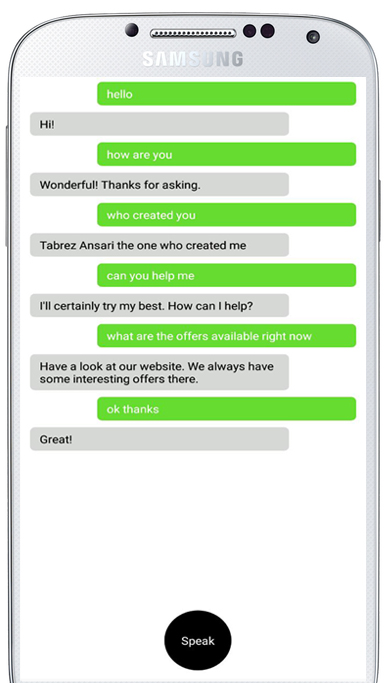

# React Native Virtual Assistant 
> Made with React Native And use of Dialogflow V2.0

A Virtual Assitant made with React Native and Dialogflow API's. It's uses the Google's Speech recognition kit
for the input from the user and convert it into the text and then the text is send to the Dialogflow.
Dialogflow checks the instances and based on the intent it reponse back to the client.

## Dialogflow Setup

- Go to https://dialogflow.com get logged in to the site
- Go to Prebuilt Agent tab in left side nav bar click on it.
- Go to Prebuilt Agent tab in left side nav bar click on it.
- Select "Small Talk" Agent and Done.
- Now Copy the Client access token from your console and paste it in App.js file.
 
That's it. Good to go

